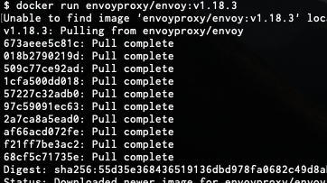
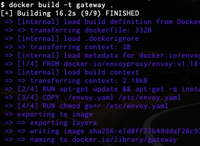
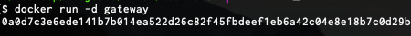
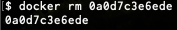

``Theory
``
1. Что такое образ docker, какими способами можно получить в системе образы докер?

```
Образ Docker – это доступный только для чтения шаблон, который задает настройки контейнера. 
Образ содержит исполняемый код вместе с определениями любых библиотек и зависимостей, которые могут понадобиться для его работы. 
Получить докер-образ можно из архива образов Docker Hub или создав его с помощью Dockerfile.
```
2. Что такое слой докер образа?
```
Docker-образ состоит из слоев, каждый из которых описывает какую-то инструкцию. Docker объединяет информацию из каждого слоя, и создает шаблон-образ, из которого запускается контейнер, в котором выполняются инструкции из каждого слоя данного образа.
```

3. Как посмотреть список образов, удалить? Посмотреть все слои в образе?
```
    docker images - список образов
    docker rmi <ImageName> - удалить образ
    docker history <ImageName> - посмотреть слои образа
```
4. Напишите команду запуска docker контейнера
```
    docker run [options] <ImageName>
   ``` 
5. Напишите команду входа внутрь docker 
контейнера
```
    docker exec [options] <ContainerName> <Command>
   ``` 
6. Какие режимы работы сетей есть в docker? Опишите как они работают?
```
    bridge – программный режим моста (по умолчанию)
    host – изолированный контейнер, доступ только в пределах Docker-хоста
    overlay – распределенная сеть между множественными Docker-хостами 
    macvlan – эмуляция устройства, позволяет контейнеру получить MAC адрес и подключиться к физической сети
    none – нет сети
   ``` 
7. Что такое docker-compose? Как применяется?
```
Docker-compose – инструмент для создания и запуска многоконтейнерных docker-приложений. Используется в основном для разработки, тестирования и настройки среды, а также непрерывной интеграции.

Использование docker-compose обычно разделяется на три этапа:
 1. Определение окружения приложения в Dockerfile;
 2. Определение сервисов из которых будет состоять приложение в конфигурационном файле docker-compose.yml;
 3. Запуск приложений.

Compose имеет команды для управления всем жизненным циклом приложения:
 - Запуск, остановка и пересоздание сервисов
 - Просмотр статус запущенных сервисов
 - Поток вывода журнала запущенных служб
 - Выполнение одноразовых команд в сервисах
 ```

``Practice
``

1. Запуск любого контейнера с docker-hub
```
    docker run <ImageName>
```


2. Создание своего собственного docker image (например nginx или любого другого)

[Dockerfile](Dockerfile)

   ```
    docker build -t <ImageName> <Path> - сборка контейнера
```


3. Запуск контейнера, остановка, удаление
```
    docker run -d <ImageName> - запуск отсоединенного конейтнера
```



    
    docker stop <ContainerId> - остановка контейнера
    


    
    docker rm <ContainerId> - удаление контейнера
    


4. Написание микросервиса в docker-compose с сетями bridge и macvlan

[docker-compose.yml](docker-compose.yml)

```
    docker-compose build - сборка контейнеров
    docker-compose up - запуск контейнеров
    docker-compose down - остановка контейнеров
```