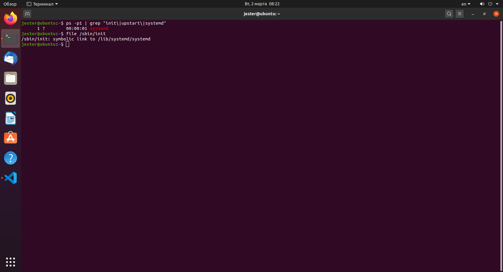

1) Основные принципы Unix-way  
	* Одна задача - одна программа  
	* Есть множество путей решения  
	* Все есть файл

2) Линус Торвальдс является разработчиком чего  
	Ядра ОС Linux 

3) Как посмотреть  название ядра системы из консоли?   
	`uname -r`

4) Промежутки измерения загрузки системы для команды uptime следующие  
	1,5,15 минут

5) какой командой узнать сколько занято на HDD  
	`df -H`

6) какие разделы содержит вывод команды vmstat
	* procs (количество процессов)
	* memory (память)
	* swap (файл подкачки)
	* io (загрузка ввода-вывода)
	* cpu (загрузка процессора)

7) Описать работу своего Linux дистрибутива: какое ядро, архитектура, размеры hdd, объеме ОЗУ, загрузке процессора и т.д  

    * Ядро, архитектура:  
    ```
    jester@ubuntu:~$ uname -ar
    Linux ubuntu 5.4.0-48-generic #52-Ubuntu SMP Thu Sep 10 10:58:49 UTC 2020 x86_64 x86_64 x86_64 GNU/Linux
    ```
     * Информация HDD:  
     ```
     jester@ubuntu:~$ df -H
     Файл.система   Размер Использовано  Дост Использовано% Cмонтировано в
     udev             999M            0  999M            0% /dev
     tmpfs            206M         1,7M  204M            1% /run
     /dev/sda5         21G         8,1G   12G           42% /
     tmpfs            1,1G          18M  1,1G            2% /dev/shm
     tmpfs            5,3M         4,1k  5,3M            1% /run/lock
     tmpfs            1,1G            0  1,1G            0% /sys/fs/cgroup
     /dev/loop2       229M         229M     0          100% /snap/gnome-3-34-1804/60
     /dev/loop5        66M          66M     0          100% /snap/gtk-common-themes/1506
     /dev/loop1        59M          59M     0          100% /snap/core18/1932
     /dev/loop7        54M          54M     0          100% /snap/snap-store/481
     /dev/loop8        33M          33M     0          100% /snap/snapd/9721
     /dev/sda1        536M         4,1k  536M            1% /boot/efi
     tmpfs            206M          62k  206M            1% /run/user/1000
     /dev/loop9       104M         104M     0          100% /snap/core/10823
     /dev/loop10      158M         158M     0          100% /snap/code/55
     /dev/loop11       59M          59M     0          100% /snap/core18/1988
     /dev/loop0        33M          33M     0          100% /snap/snapd/11036
     /dev/loop6        54M          54M     0          100% /snap/snap-store/518
     /dev/loop12       69M          69M     0          100% /snap/gtk-common-themes/1514
     /dev/loop13      230M         230M     0          100% /snap/gnome-3-34-1804/66
    ```
     * Информация ОЗУ:  
     ```
     jester@ubuntu:~$ free -h
              всего        занято        свободно      общая  буф./врем.   доступно
     Память:       1,9Gi       1,2Gi       136Mi        31Mi       597Mi       548Mi
     Подкачка:       923Mi       316Mi       607Mi
     ```
     * Загрузка процессора:  
     ```
     jester@ubuntu:~$ uptime
     08:23:00 up 49 min,  1 user,  load average: 0,08, 0,07, 0,09
     ```
     
