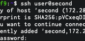
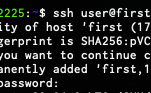
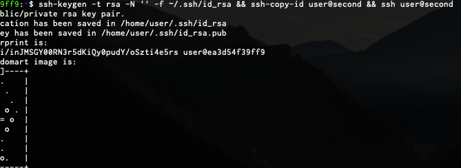
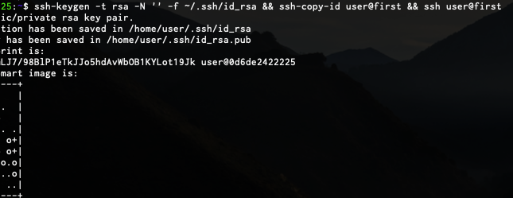
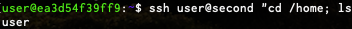
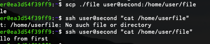
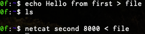

 1. Сделать image контейнера с необходимым ПО для запуска sshd

[Dockerfile](dockerfile)

[docker-compose](docker-compose.yml)

2. Запустить docker-compose поднять два ssh сервера
```
`docker-compose up --build -d`
```

3. Вход по паролю




4. Вход по ключу

1 to 2



2 to 1



5. Выполнить команду



6. Передать файл



7. Продемонстрировать простейший обмен данными с помощью утилиты netcat

Send



Recieve


