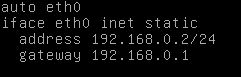
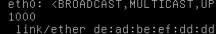
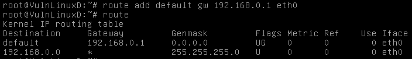
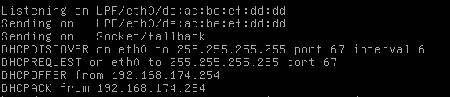
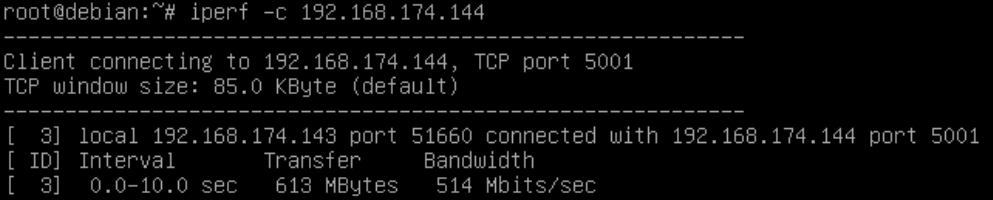
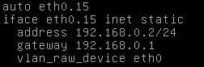
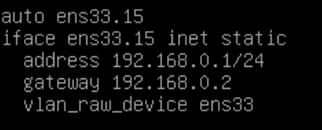
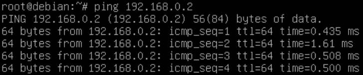

1. Произвести настройку IP адреса сетевого интерфейса eth0 через конфиг и на лету
- Через конфиг:



```
systemctl restart networking
```
-на лету
```
ifconfig eth0 192.168.0.2
```
2. Остановить и запустить сетевой интерфейс eth0

```
ifconfig eth0 down
```
```
ifconfig eth0 up
```
3. Произвести смену аппаратного (MAC) адреса сетевого интерфейса eth0;




4. Показать таблицу сетевых маршрутов. Установить маршрут по умолчанию;



5. Получить 
настройки IP от DHCP сервера;



6. Проверить пропускную способность между виртуальными машинами



7. Hастроить связь между виртуальными машинами через vlan 15




